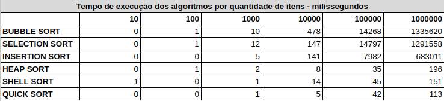
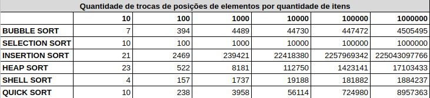

# data-structure

Projeto dedicado à prática e a estudos referentes a estrutura de dados utilizando a linguágem **Java**.

### Estruturas de dados já adicionadas
- Array (Vetor)
- Linked List (Lista encadeada)
- Queue (Fila - Tipo abstrato de dados)
- Stack (Pilha - Tipo abstrato de dados)
- Binary Tree (Árvore binária)

### Algoritmos já adicionados
- Linear Search
- Binary Search
- Bubble Sort
- Insertion Sort
- Selection Sort
- Heap Sort
- Quick Sort
- Shell Sort

### Comparando algoritmos de ordenação

#### Comparando tempo de execução

#### Comparando quantidade de trocas de posição

